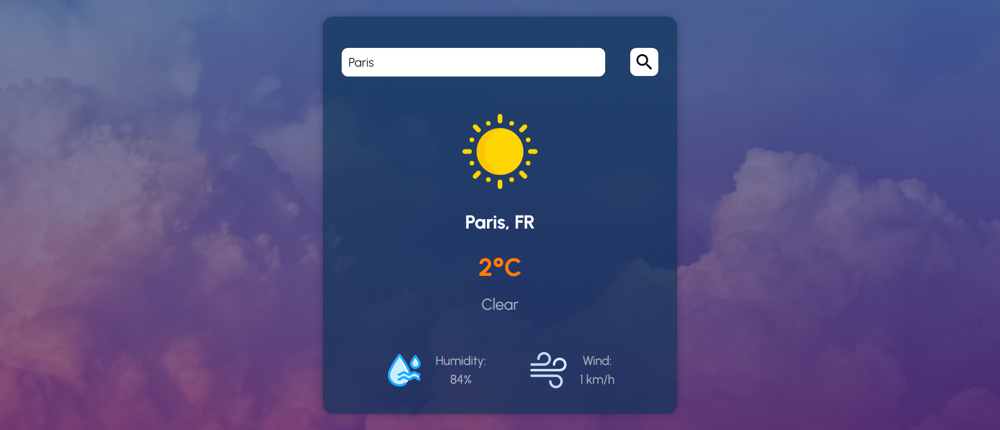
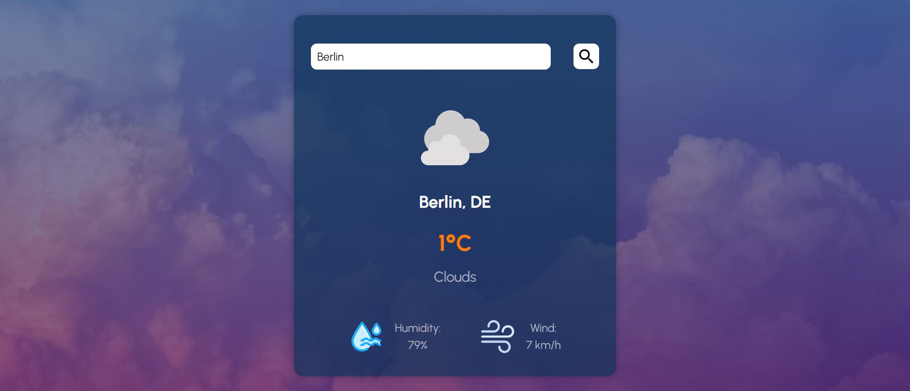

# Weather App
A weather app using OpenWeatherMap API with HTML, CSS and JavaScript

Live preview: https://goksunberen.github.io/weather-app/index.html

## Screenshots

## For the images:
- Photo by <a href="https://unsplash.com/@lukaszlada?utm_content=creditCopyText&utm_medium=referral&utm_source=unsplash">Łukasz Łada</a> on <a href="https://unsplash.com/photos/sea-of-clouds-LtWFFVi1RXQ?utm_content=creditCopyText&utm_medium=referral&utm_source=unsplash">Unsplash</a>
- Weather icons: www.freepik.com
- https://www.flaticon.com/authors/adriansyah